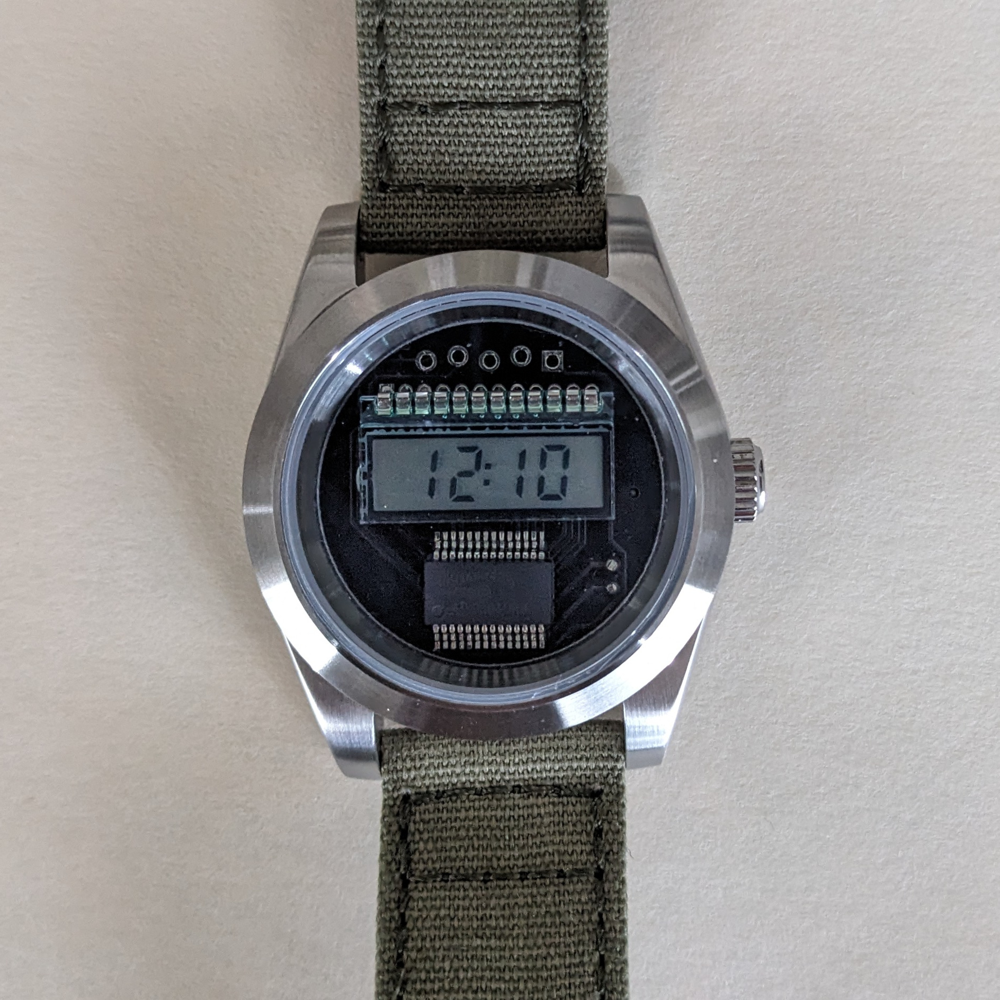
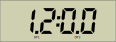
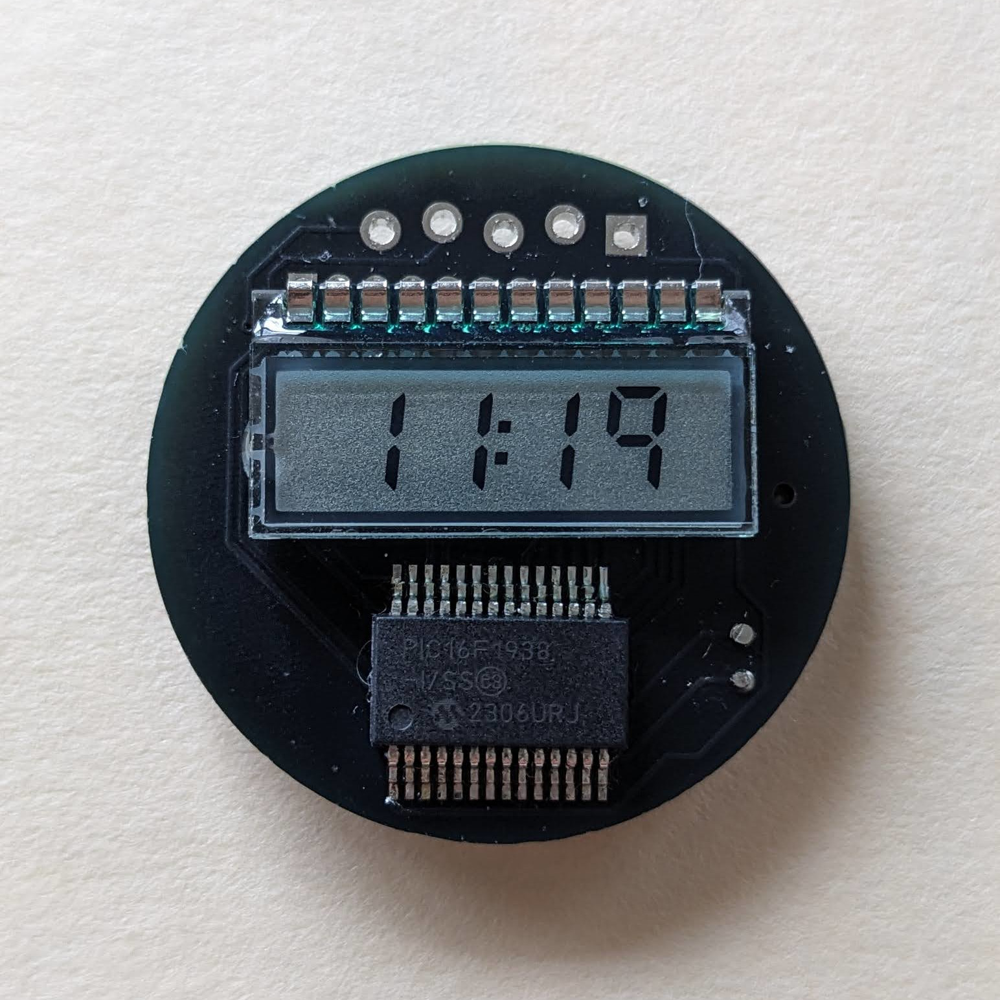
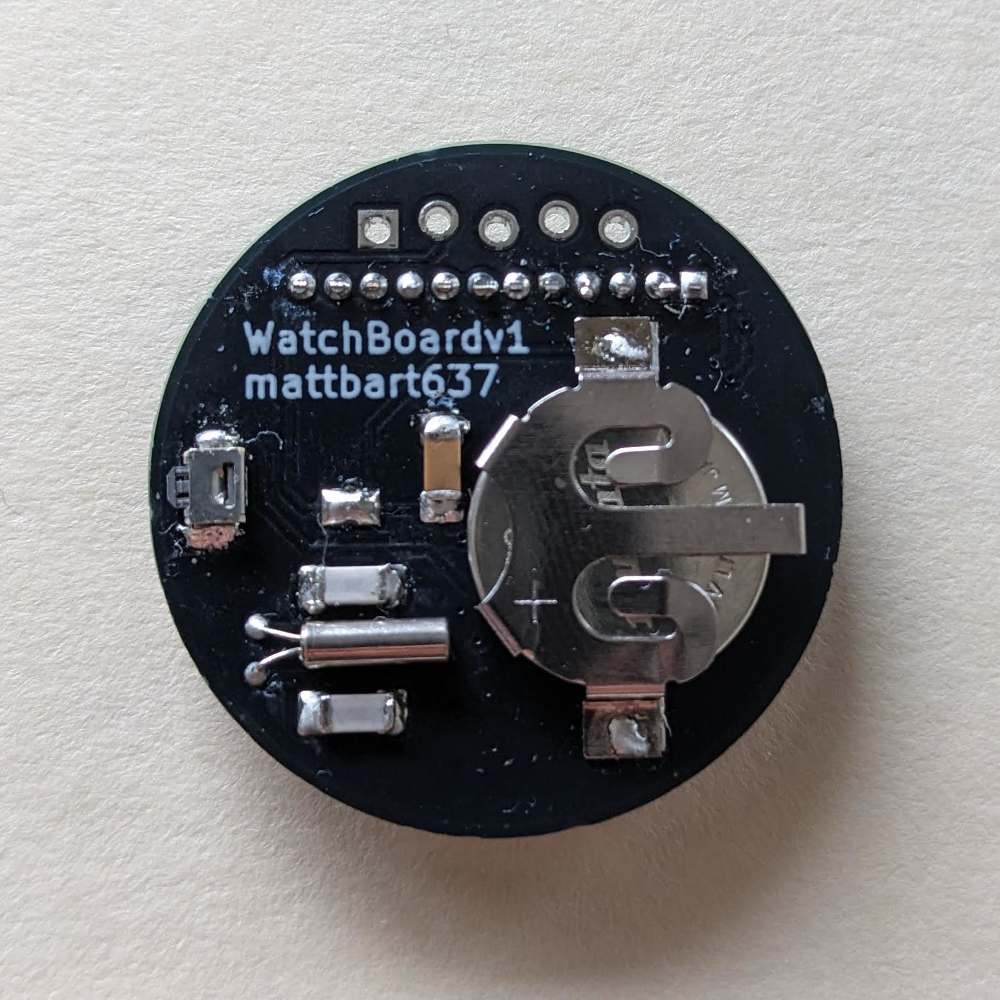

# PCB Watch

A digital watch with a PIC16 and 4-digit segmented LCD display on a 2-layer PCB. It's my first microcontroller project outside the Arduino environment and the smallest SMT soldering I've done to date.

This build was heavily inspired by [Joe Sullivan's take](http://joesul.li/van/watch/) on a PIC16 watch. I loved finished look but didn't trust my soldering skills for the tiny hall-effect sensor or the daughter board it mounts on. Instead I simplified the interface to a single push-button. It makes the hardware simpler, but the firmware took a while to wrap my head around. 

I designed it for Seiko NH35 watch cases that accept 29mm dials, mostly because the NH35 has a strong modding community and there's plenty of aftermarket cases available. I got mine on AliExpress for under $20. A pair of 3D-printed spacers completes the build.

# Specs

| | |
| --- | --- |
| Dimensions | 29mm diameter, 7mm thick |
| Accuracy | 0.43 seconds/day, ~5 PPM |
| Current draw | 28.5µA @ 3V |
| Battery type | CR1220 |
| Runtime on 40mAh battery | ~58 days (estimate) |

# How to Use 

Once you insert a CR1220 battery it starts keeping time from 12:00.

1. Press and hold the button until Decimal Point 3 (DP3) lights up. Short press the button to change the minute.
2. Press and hold again and Decimal Point 1 (DP1) will light instead. Short press the button to change the hour.
3. Press and hold a final time until the decimal point turns off, setting the time.

# Photos

# Improvements for v2

My biggest gripe by far is with the 3D printed spacers, which work well but are tricky prints. I didn't include any anti-rotation features on the board, so instead the spacers have tiny pegs that sit in the programming header through holes. The parts aren't well suited to an FDM printer; mine were done on a DLP resin machine.

The spacer has a small tab that sticks into the crown opening to stop it rotating within the watch case. It works on the watch case I'm using (though not on all the ones I've tried) but blocks access to the button. That means disassembling the watch to set the time. Maybe not a huge deal since the battery life is only ~2 months, but I'd do it differently next time.

I want to make the spacers less demanding prints and include a keying tab on the board itself. I'd also swap the button with an edge-mount one (that sits in a recess on the board) to bring it more in line with the crown. Preferably one with a more tactile feel too.

Some other things I'd change:
- Add 24-Hour time support 
- I think there's room for reducing the current consumption and extending the battery life further.
- The manufacturer's footprint for the battery holder has the ground pad smaller than the battery diameter. On the next rev I'd make the pad larger than the battery diameter to get better contact. Otherwise you have to flood the pad with solder (making it higher than the surrounding soldermask) to make contact.

# Credits & References

Joe Sullivan's PIC16 watch: <http://joesul.li/van/watch/>

NH35 Specifications: <https://www.timemodule.com/uploads/attachments/download/Spec%20Sheet/NH35_SS.pdf>

It's not the same implementation or even the same microcontroller I used, but Microchip's Yet Another Clock Featuring the PIC16C924 application note was very helpful: <https://www.microchip.com/en-us/application-notes/an649>
